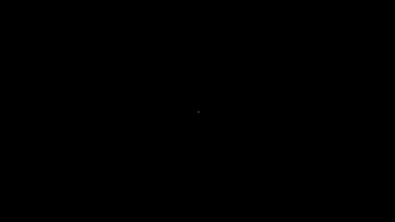

# FijiRandomWalker
2D random walk animation as ImageJ macro

  

This macro creates an RGB stack of a random walk. The random walker is displayed as red pixel. Each frame in the stack is a single step. p. 

Video
--------
[Random Walk (1 hour)](https://www.youtube.com/watch?v=8K2AHE5Hums)
